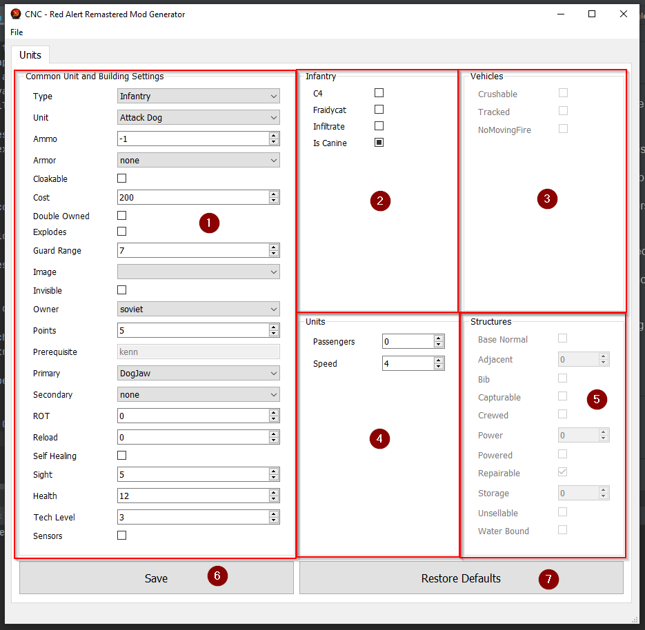

**Developed by David Walshe**

# Table of Contents:

- [Introduction](#introduction)
- [Limitations](#limitations)
- [Installation](#installation)
- [Usage](#usage)
    - [Compiling Mods with Custom Maps](#compiling-mods-with-custom-maps)
    - [Unit and Structure Editing](#unit-and-structure-editing)
- [Issues](#issues)

# Introduction

[Back to top](#table-of-contents)

***"Welcome back, Commander !"***

If you are like me, Red Alert played a big part in your life in the mid/late 1990's. Some of my fondest childhood 
memories were watching my dad and uncle play Red Alert into the early hours of the morning. To a six year old, 
it was like magic watching base building, tank rushes and sneaky tactics using Tanya and Chinooks.

With the release of [Command and Conquer Remastered](https://store.steampowered.com/app/1213210/Command__Conquer_Remastered_Collection/), 
a lot of those fond memories came rushing back. I am fortunate enough to still have my dad and uncle to play 
with 24 years later, along with my brothers and cousins who were also captivated by the series from their childhoods.

As a tribute to all those late hour sessions watching Red Alert in the 90's and the new found love for the remastered edition, I 
have built a small application unlocking a lot of the mod-ability of Red Alert. The app is not targeted towards
**power-users** who are well versed in the art of making **nurple maps**. The application is aimed more at casual gamers
who want to adjust various mechanics of the game for **single-player skirmish** and **multi-player custom maps** without
messing with .ini files manually.

The application gives users a Graphical User-Interface (GUI) to tweak and adjust various aspects of the game. The 
following sections explain in detail how to use the application to tweak numerous settings.

I hope you find the application helpful and easy to use to create cool and fun mods for your own maps and try 
not to cheat ( to much ;-) ).

# Limitations

[Back to top](#table-of-contents)

Before continuing, please read the following limitations:

1) Nurple map modding is only available on user generated maps. The base game maps cannot be modded using this application.
This limitation is due to the design of the game and how mods are utilised. You must create a custom map using the built in
Map Builder application that comes with the remastered edition of the game to make use of Mods.

2) Mods are implemented on a map-by-map basis. Map modding is the only way to ensure mods can be used with online multiplayer. 

---

# Installation

[Back to top](#table-of-contents)

The application is compiled into a native .exe with all the .dll bindings included meaning no 3rd-party dependencies.

To install the application follow the steps below:
 
1) Download the latest release **.zip** from the [GitHub Releases](https://github.com/DavidWalshe93/Red_Alert_Mod_Toolkit/releases) 
section. 

   **Note**: If you download an **alpha** version of the tool, please be mindful that this version may contain bugs.

2) Once the .zip archive is downloaded, unpack it using [7-Zip](https://www.7-zip.org/download.html) 
or any other zip extraction program.

3) Inside the unzipped archive you should find a .exe file named "**Red Alert Mod Toolkit.exe**", launch it via a double
click.

4) You should see a GUI open looking similar to the image below if everything was successful.

---

# Usage

[Back to top](#table-of-contents)

## Compiling Mods with Custom Maps

[Back to top](#table-of-contents)

The application requires the user selects a folder where they wish to attach mods to custom maps they have created.

The application does not overwrite or edit user maps, this is to prevent loss of map data. Instead it copies the contents of a 
map file (.mpr files) and appends the mod edits on top of it. The resulting data is then saved to a second file with 
the naming convention: **\<ORIGINAL_MPR_FILE_NAME\>_nurple_mod.mpr**

This allows the original map data to be left untouched while creating a secondary file with mods included. This was done to prevent original map corruption from occurring on the base map as they can take some time to make.

To compile your mods to you custom maps use the shortcut "**Alt + C**".

If this is you first time compiling mods, the application will ask you for the location of your custom maps via a 
file dialog.

Navigate the dialog to find the folder you save you custom maps under, by default they are found under:

> C:\Users\\<USER\>\Documents\CnCRemastered\Local_Custom_Maps\Red_Alert\

Once you have the directory selected, the application will search for all .mpr files in this directory. For each file it
finds it will create a **\<ORIGINAL_MPR_FILE_NAME\>_nurple_mod.mpr** sister file with you desired mods included.

Start up the game and test your mods in an AI Skirmish match. This is to ensure your chosen mods don't have any 
game breaking side-effects.

Once you are happy with the balance and stability of your mods, you can publish you modded map.

Open the <FILE>_nurple_mod.mpr map in the *Map Editor Application* to publish it and to play with friends.

---

## Unit and Structure Editing

[Back to top](#table-of-contents)

The first tab in the GUI is targeted at units and structure editing.  

1) **Common Unit and Building Settings**
    
    This section of the tab holds the common settings that effect both buildings and movable units of all kinds.
    
2) **Infantry**

    The infantry of Red Alert have four specific attributes associated with them. These attributes should only be 
    changeable when the infantry class type is selected. They are disabled for all other class types as they are not relevant.
    
3) **Vehicles**

    The vehicles of Red Alert have three specific attributes associated with them. These attributes should only be 
    changeable when the vehicles class type is selected. They are disabled for all other class types as they are not relevant.
    Vehicles referred to any land-based, wheeled or tracked unit. They do not include navel or air units.
 
4) **Units**

    All movable units (a.k.a. not buildings) of Red Alert have three specific attributes associated with them. These attributes should only be 
    changeable when a unit class class is selected i.e. Infantry, Vehicles, Aircraft, Ships.
    
5) **Buildings**

    All structures (a.k.a. non-movable units) of Red Alert have 11 specific attributes associated with them. These attributes should only be 
    changeable when the buildings class type is selected i.e. Infantry, Vehicles, Aircraft, Ships.

6) **Save**
    
    *Keyboard Shortcut:* **Ctrl+S**
    
    This button is used to save the changes for the currently selected unit.
    
7) **Restore Defaults**: 

    This button is used to restore the original game defaults to the selected units.

---

# Issues

[Back to top](#table-of-contents)
